Installing & Configuring LEMP Stack on AWS EC2 (Ubuntu)
LEMP stands for Linux, Nginx, MySQL, PHP, and it’s used for hosting dynamic websites. Below are the complete steps to install and configure it.
________________________________________
STEP 1: Launch an EC2 Instance with Ubuntu
1.	Log in to AWS Console → Go to EC2 Dashboard.
2.	Click "Launch Instance" and configure: 
o	Name: Choose any name for your server.
o	AMI (OS): Select Ubuntu 22.04 LTS (latest).
o	Instance Type: Choose t2.micro (Free Tier eligible).
o	Key Pair: Create a new key pair (or use an existing one).
o	Security Group (VERY IMPORTANT) → Allow these ports: 
	SSH (22) → To connect via terminal
	HTTP (80) → For web traffic
	HTTPS (443) → For secure web traffic
o	Click Launch and wait a few seconds.
3.	Copy the Public IPv4 Address of your EC2 instance (you’ll use this later).
Expected Output:
•	Instance launches successfully and appears in the EC2 console.

2. Connecting to the EC2 Instance via SSH
Steps:
1.	Copy the Public IP Address of the instance.
2.	Open a terminal and connect using SSH: 

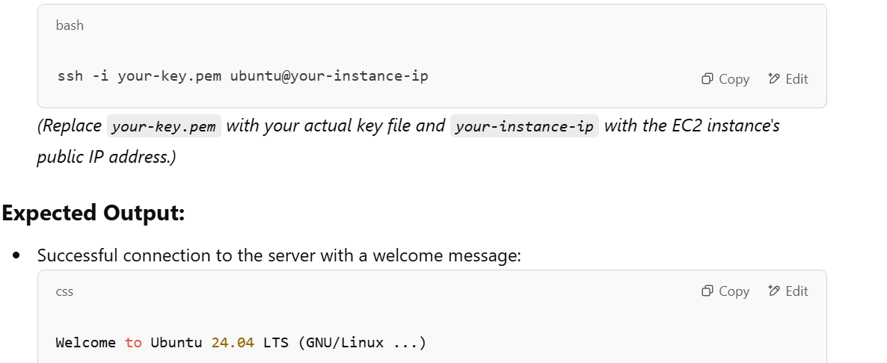
 
Expected Output:
•	Successful connection to the server with a welcome message: 
css
CopyEdit
Welcome to Ubuntu 24.04 LTS (GNU/Linux ...)

 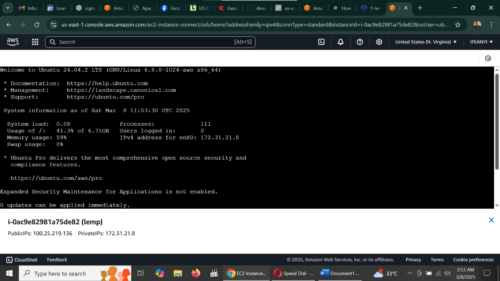

3. Updating the System Packages
 
 
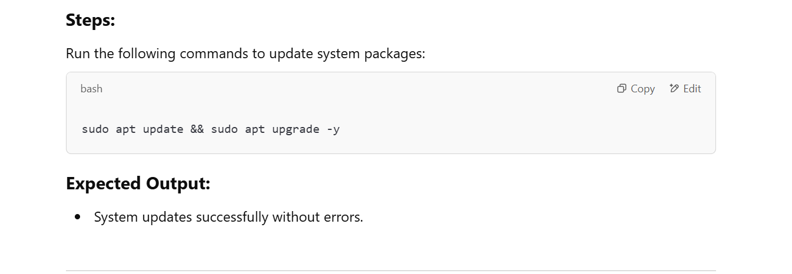

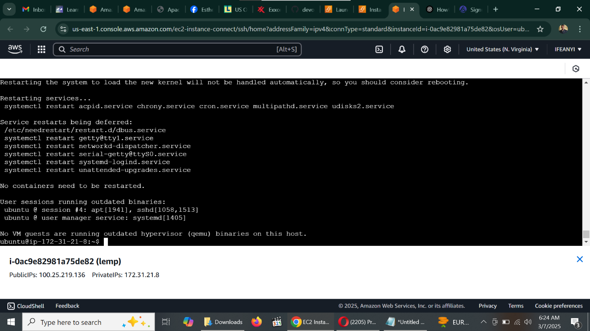

4.	Installing Nginx
 
 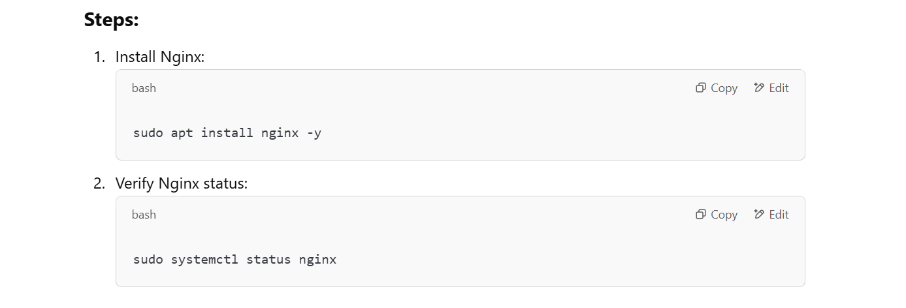

 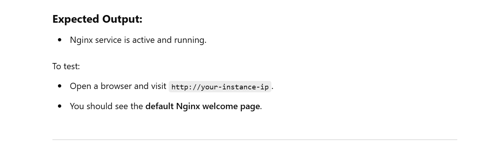

 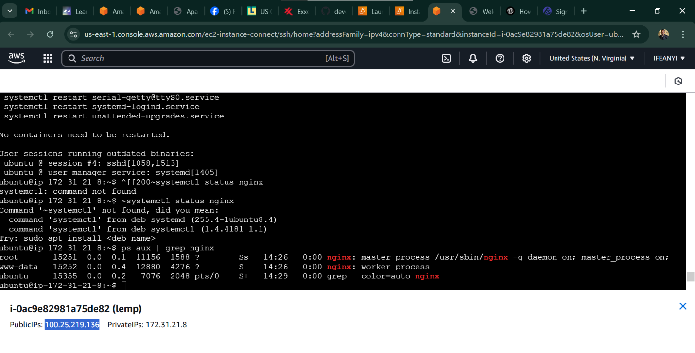

 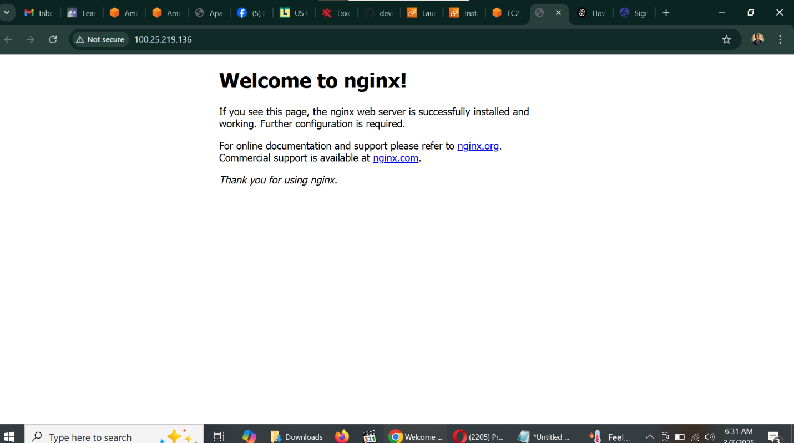

5.	Installing MySQL

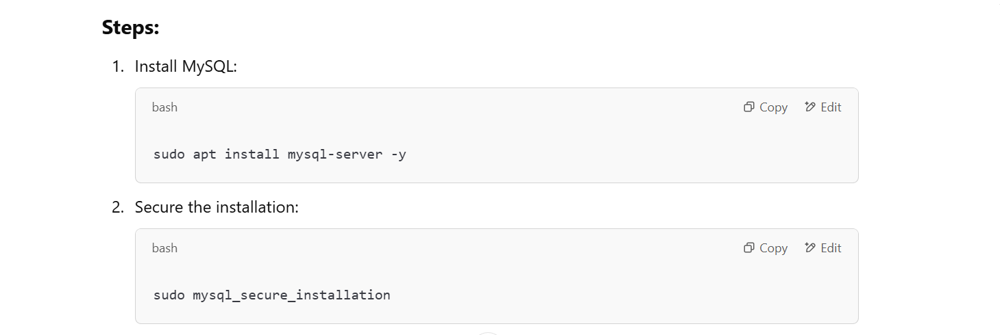

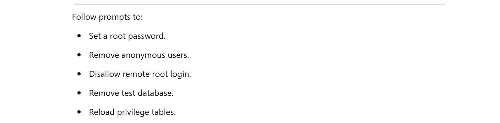

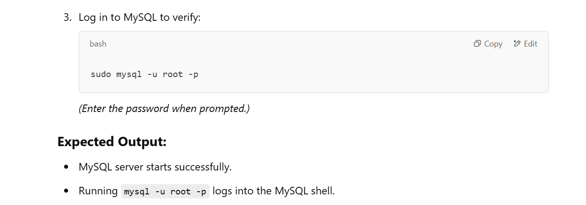

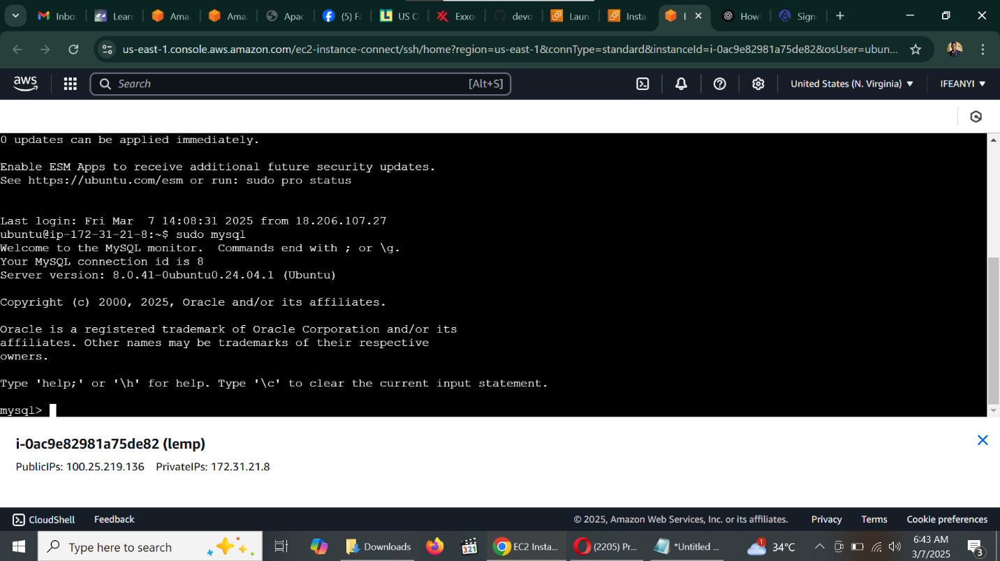
 

6.	Installing PHP
 
 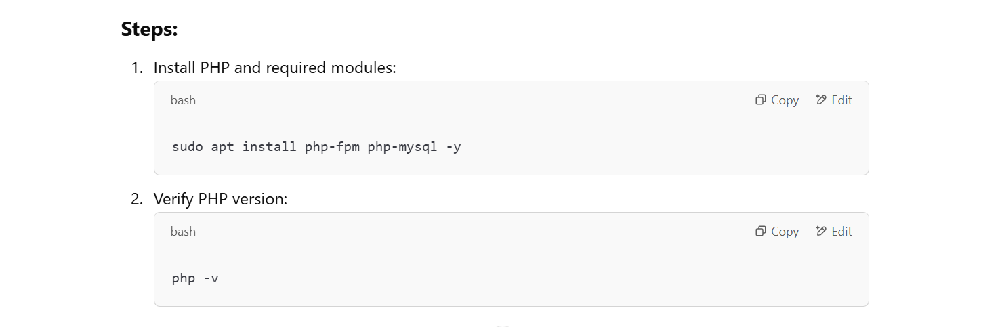

 

 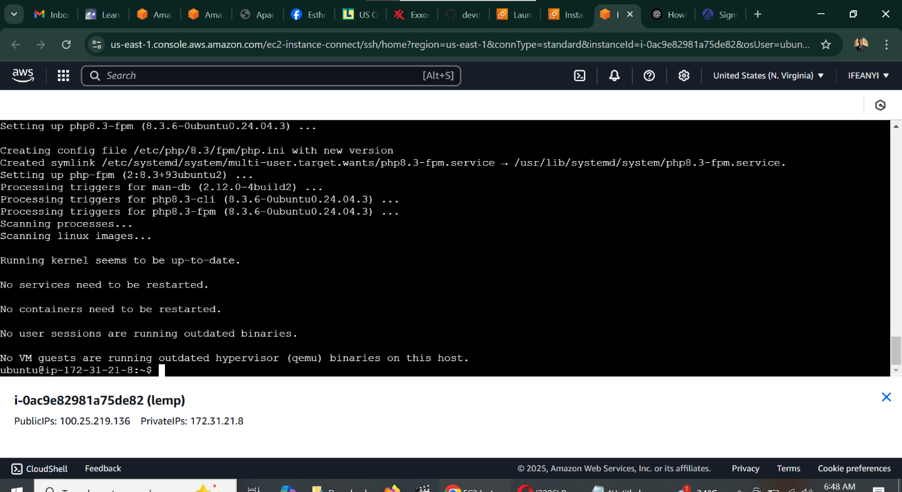

7.	Configuring Nginx for PHP

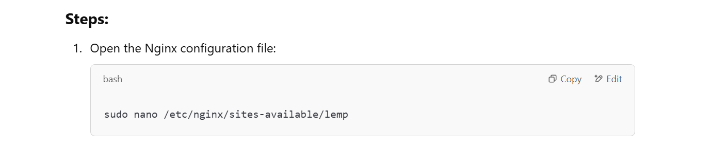
 
Paste the following configuration:
      
 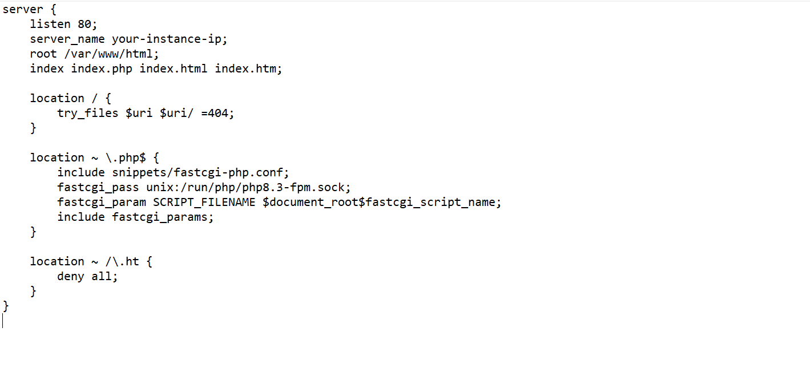

 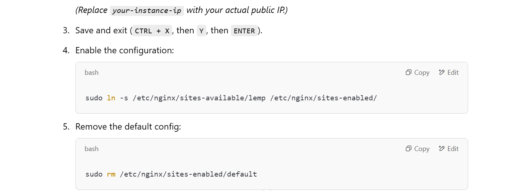

 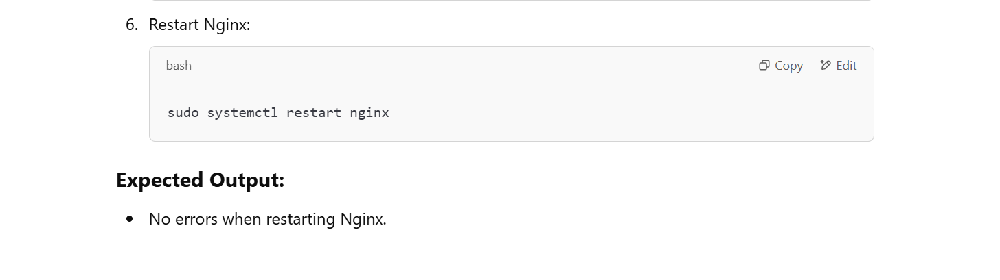

 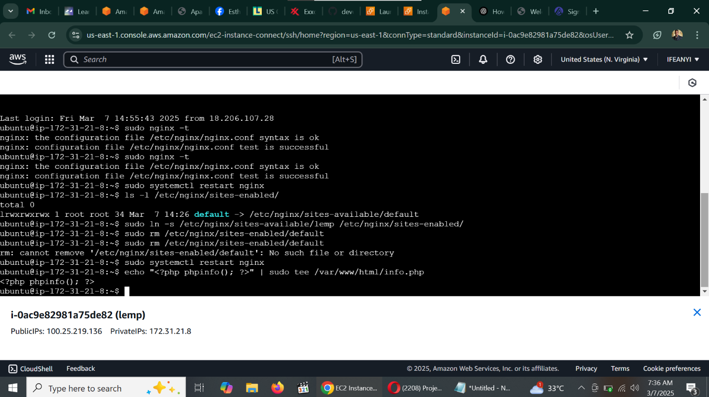

 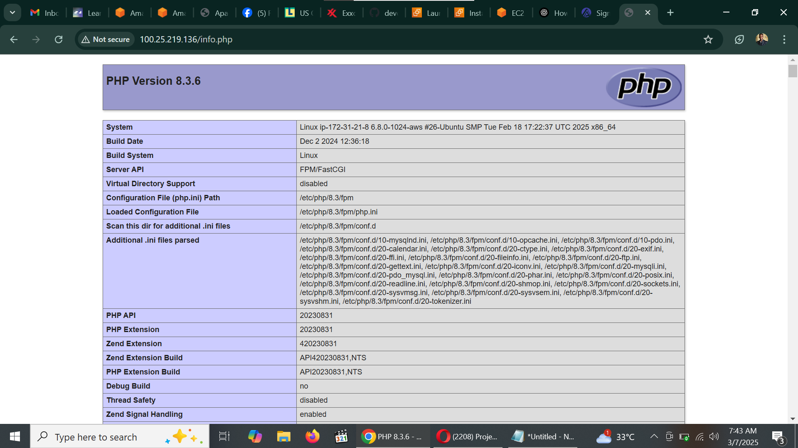
 
 
 

Conclusion:
By following these steps, you have successfully set up a LEMP stack on an AWS EC2 Ubuntu instance, configured Nginx, enabled PHP processing, and secured MySQL for database management.
This setup provides a solid foundation for deploying web applications.

