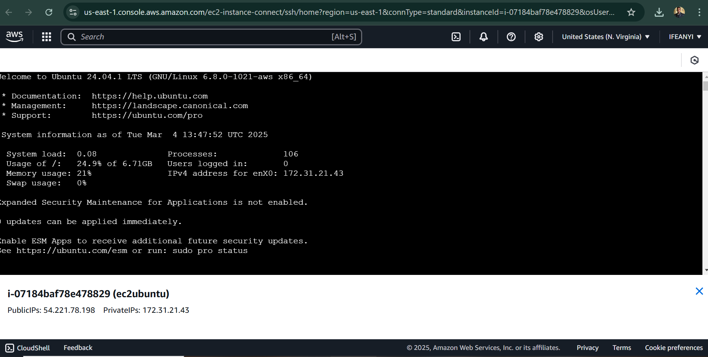
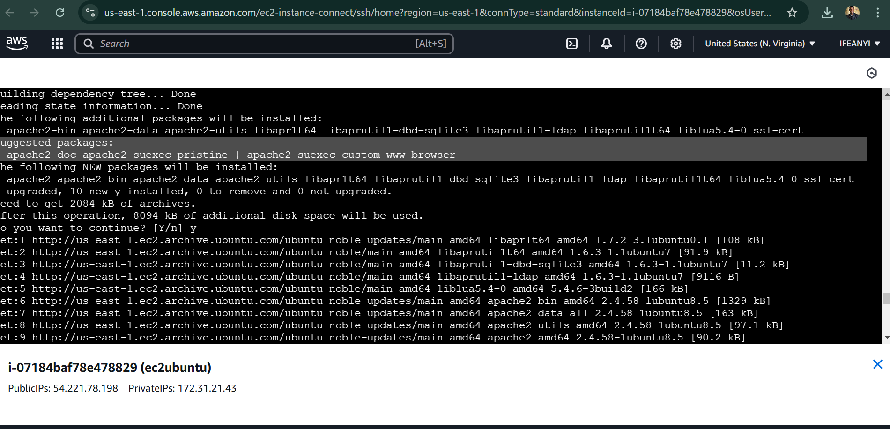
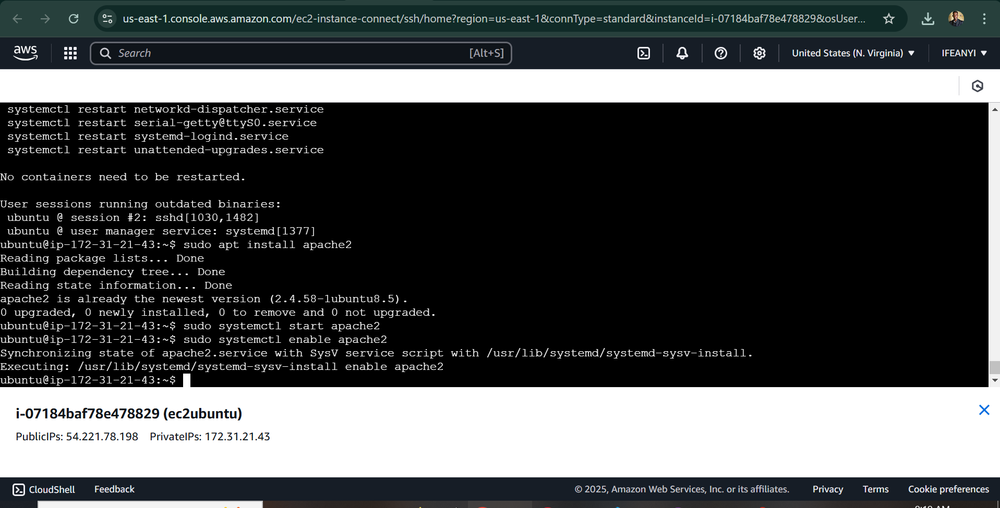

When setting up a web server on AWS, the first step is to launch an
Ubuntu EC2 instance. This instance will act as the virtual machine where
we install and configure Apache, a popular web server used for hosting
websites.

In this guide, I\'ll walk you through the step-by-step process of:

1.  **Launching an Ubuntu EC2 instance**

2.  **Connecting to the instance via SSH**

3.  **Installing and configuring Apache to serve web pages**

<!-- -->

1. Launching an Ubuntu EC2 Instance on AWS

   

2. Connecting to the Instance via SSH

   

3. Installing and Configuring Apache on Ubuntu EC2

   

4. Final Configuration

   
